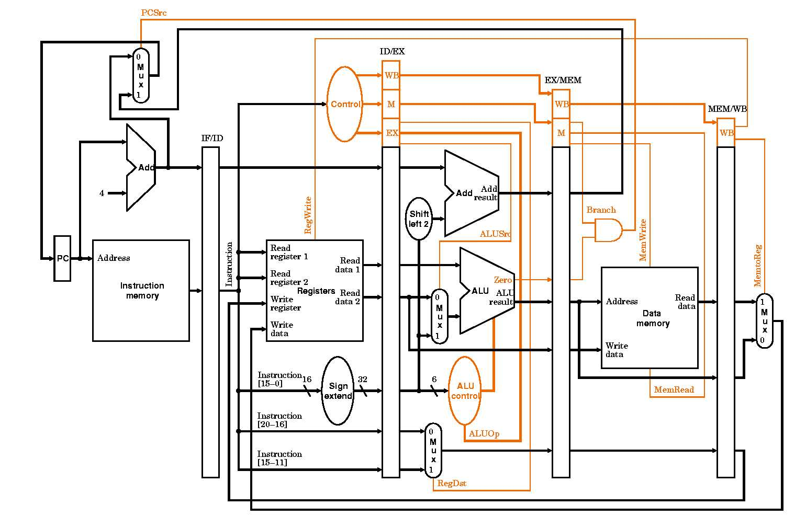

# Pipeline-Processor
Pipeline Processor based on RISC-V, implemented forwarding and hazard detection units.

Developed and Tested on [ModelSim](https://www.mentor.com/company/higher_ed/modelsim-student-edition)

